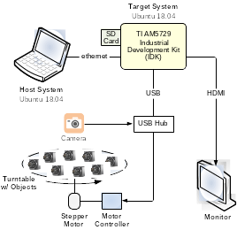

# TI / AWS Deep Learning Demo


Defect Detection using the AM57x Sitara Processor

## Introduction
This document describes a defect detection demo developed by D3 Engineering for Texas Instruments and Amazon. The demo shows the ability of the Texas Instruments Sitara platform, specifically the AM5729, to run AI applications at the edge. The AM5729 architecture has multiple processors that can be leveraged for a variety of compute intensive tasks, in this case running a MobileNetV2 neural network trained to detect defects in parts.
The parts chosen are camera modules and the defects the model is trained to detect are missing parts. In order to simulate parts on an assembly line passing by an inspection camera, a turntable was constructed containing the set of parts to be inspected. The turntable rotates a part into the field-of-view of an inspection camera, the neural network determines a pass/fail status, and then the sequence continues.

## Demo Components
### Hardware Components
he physical setup consists of a stepper motor turntable upon which the parts are placed, a USB motor controller, a USB webcam, and an HDMI display. These elements along with a host system are connected to the target system, a [TI AM5729 Industrial Development Kit](https://www.ti.com/lit/ml/sprw282b/sprw282b.pdf?ts=1593004419768&ref_url=https%253A%252F%252Fwww.ti.com%252Ftool%252FTMDSIDK572) (IDK) where the demo runs. A bootable SD card contains the Linux operating system and filesystem for the target. This is shown below.


### Software Components
There are several software components used to create the defect detection demo. On the host system,  there is the [Processor SDK for AM57x Sitara Processors - Linux](https://software-dl.ti.com/processor-sdk-linux/esd/AM57X/latest/index_FDS.html) that provides a set of AM5729 development tools and enables the creation of a bootable Linux system image for the AM5729-based target system. The Processor SDK also provides TVM/Neo, a deep learning compiler that takes a model trained on the host and optimizes it for execution on the AM5729 Sitara processor.

On the target system, there is the TI SDK embedded Linux system created using the Processor SDK that provides the operating system for the AM5729 evaluation board. Also required on the target is TIDL (Texas Instruments Deep Learning), a set of open-source Linux software packages and tools for executing deep learning models on TI embedded systems. TIDL provides the ability to offload deep learning compute intensive workloads from the general-purpose ARM cores to the EVE (Embedded Vision Engine) cores and C66x DSP cores on the AM5729 Sitara processor. This can significantly speed up these types of workloads. TIDL also includes the Neo-AI-DLR (Deep Learning Runtime) an open source common runtime for deep learning models and decision tree models compiled by TVM, AWS SageMaker Neo, or Treelite. TIDL requires pre-trained compiled models stored on the target device filesystem as training on the target device is not currently supported. TIDL and TVM are included in the Processor SDK software distribution.Also residing on the target are two trained MobileNetV2 neural network models, one compiled for the ARM general purpose CPUs and the other for the EVE and C66x DSP hardware accelerators on the AM5729 Sitara processor. These models are the software components that perform the actual defect detection.

Lastly is the defect detection demo application. The application code is written in C++ and performs model loading and switching, controls the turntable, acquires images, invokes the model, displays output, and provides a command line interface to control the demo.  

The major software components described above are shown below.


## The Neural Network Model
The demo utilizes MobileNetV2, a general-purpose computer vision neural network designed for mobile devices. MobileNet is based on the foundational work by Google researchers as described in the publication [MobileNets: Efficient Convolutional Neural Networks for Mobile Vision](https://arxiv.org/pdf/1704.04861.pdf). MobileNetV2 builds upon the ideas from MobileNetV1 as described in a [Google AI Blog Entry](https://ai.googleblog.com/2018/04/mobilenetv2-next-generation-of-on.html). The [original tensorflow implementaion of MobileNetV2](https://github.com/tensorflow/models/tree/master/research/slim/nets/mobilenet) is available on GitHub.

The demo models were trained using a set of annotated images of the objects used in the demo, in this case camera modules presented to the system on a turntable. Acquiring training images, annotating them, training the model, compiling it for the target, and evaluating its effectiveness can be a complex and time-consuming process. The reader is encouraged to seek out information on the internet and other sources to familiarize themselves with the practical implications of creating and training convolutional neural network models, in particular the MobileNetV2 model used in the demo.

The demo includes pretrained models compiled for the AM5729 processor.

## Building The Demo
This section describes how to build the demo. It assumes that the requisite hardware components as described in section 2.1 have been assembled and the host and target systems are ready for software installation.

The high-level steps to build the demo are shown below.


The following sections describe each step.

### Clone the Demo Code from the Git Repository to the Host

To acquire the demo code, it must be cloned from the git repository to the host system. Create a directory on the host, and from that directory issue the following command.

```
git clone --recursive https://github.com/D3Engineering/d3-ti-kit.git
```
The directory structure of the demo code in the git repository is shown below.


### Download and Install the TI Processor SDK on the Host
To develop code for AM5729 Sitara processor and create a bootable SD card, the [https://github.com/D3Engineering/d3-ti-kit.git](https://software-dl.ti.com/processor-sdk-linux/esd/AM57X/latest/index_FDS.html) must be installed on the host system. For a complete overview of the SDK, please refer to the [Processor SDK Linux Software Developer’s Guide (SDG)](https://software-dl.ti.com/processor-sdk-linux/esd/docs/06_03_00_106/linux/index.html). The demo file target/Makefile expects the Processor SDK to be extracted to target/ti-processor-sdk. This can be its actual install location or a symlink. To add all the cross-compile items (libs, compilers, etc.) source env.sh ( . env.sh ) available in the target directory of the downloaded demo code.

The Processor SDK contains the code and tools used to develop for support TI devices and has the following top-level directories and files.


* bin - Contains the helper scripts for configuring the host system and target device. Most of these scripts are used by the setup.sh script
* board-support - Contains the SDK components that need to be modified when porting to a custom platform. This includes the kernel and boot loaders as well as any out of tree drivers.
* docs - Contains various SDK documentation such as the software manifest and additional user’s guide. This is also the location where you can find the training directory with the device training materials.
* example-applications - Contains the sources for the TI provided example applications seen during the out-of-box demonstration.
* filesystem - Contains the reference file systems. These include the smaller base file system as well as the full-featured SDK file system.
* linux-devkit - Contains the cross-compile toolchain and libraries to speed development for the target device.
* Makefile - Provides build targets for many of the SDK components from the top-level of the SDK.
* Rules.make - Sets default values used by the top-level Makefile as well as sub-component Makefiles.
* setup.sh - Configures the host system as well as the target system for development.

### Create a Bootable SD Card for the Target
Create a bootable SD card for the AM5729 target system using the [instructions provided by Texas Instruments](http://software-dl.ti.com/processor-sdk-linux/esd/docs/06_01_00_08/linux/Overview_Getting_Started_Guide.html#linux-sd-card-creation-guide). Note that a 16GB SD card is recommended. The reader is encouraged to familiarize themselves with the TI SD card documentation as there are many installation permutations possible. Briefly, the steps to create a bootable SD card on the host system are as follows.

1. Create the 1st partition: 100MiB, FAT32, label=”boot”, boot flag
2. Create the 2nd partition: 8+GiB, ext3 or ext4, label=”rootfs”
3. Deploy the filesystem to rootfs partition:
```
sudo tar pxf ${TIDL_PLSDK}/filesystem/tisdk-rootfs-image-am57xx-evm.tar.xz -C /path/to/mounted/rootfs/
```
4. Deploy pre-builts to boot partition:
```
cp ${TIDL_PLSDK}/board-support/prebuilt-images/MLO-am57xx-evm /path/to/mounted/boot/MLO
cp board-support/prebuilt-images/uEnv.txt /path/to/mounted/boot/uEnv.txt
cp board-support/prebuilt-images/u-boot-am57xx-evm.img /path/to/mounted/boot/u-boot.img
```

### Install the SD Card on the Target and Boot the System
Insert the bootable SD card into the AM5729 IDK board, power up the unit, and verify that it boots correctly. You should see the Matrix1 application from the Processor SDK displayed on the HDMI monitor. Matrix can also be accessed remotely through a web browser on the host system. You can also connect to the target using a terminal emulator to view the serial console and interact with the embedded Linux system directly, for example to run ifconfig to get the IP address of the target board in order to connect to it over the network.

### Download the Motor Controller Library to the Host
Insert the bootable SD card into the AM5729 IDK board, power up the unit, and verify that it boots correctly. You should see the Matrix1 application from the Processor SDK displayed on the HDMI monitor. Matrix can also be accessed remotely through a web browser on the host system. You can also connect to the target using a terminal emulator to view the serial console and interact with the embedded Linux system directly, for example to run ifconfig to get the IP address of the target board in order to connect to it over the network.

### Download the Motor Controller Library to the Host
A [Phidgets](https://www.phidgets.com/?tier=2&catid=23&pcid=20) stepper motor controller is used to control the turntable. Download the [libphidget library source](https://www.phidgets.com/downloads/phidget22/libraries/linux/libphidget22/) (libphidget22-1.6.20200306.tar.gz) and extract it to a convenient location on the host.

### Cross Compile the Motor Controller Library on the Host
Cross-compile the libphidget motor controller library and add it to the Processor SDK standard library path using the steps shown below.
```
cd libphidget22-1.6.20200306
./configure --host=arm-linux-gnueabihf \
--prefix=<path-to>/ti-processor-sdk-linux-am57xx-evm-06.02.00.81/linux-devkit/sysroots/armv7at2hf-neon-linux-gnueabi/usr/ 
make -j4
sudo "PATH=$PATH" make install # sudo is required due to Processor SDK folder permissions
```

### Cross Compile and Build the Demo on the Host
The demo uses cmake to control the compilation and build process. The normal set of commands can be used to build the full demo. Note: If you’ve already sourced env.sh, no need to do it again. The build steps are shown below.
```
. env.sh  # source env.sh if you haven't already
mkdir build  # or cd if it already exists
cmake ..
make –j4
```

### Install the DLR Runtime on the Target
To take advantage of the TIDL accelerated model, a corresponding version of the neo-ai-dlr runtime is needed. To install this, copy target/dlr-1.2.0.linux-armv7l.tar.gz to the target, and extract at the root directory.
```
scp target/dlr-1.2.0.linux-arm7l.tar.gz am57:
cd /
tar –xzvf ~/dlr-1.2.0.linux-arm7l.tar.gz
```

### Copy the Demo to the Target
All demo libraries are linked statically, so there is no need to install any shared libraries on the target. Simply copy over the target folder using the following command.
`scp ./build/target <target-ip-or-hostname>:`

This folder contains the following.
* tvm-live - the demo binary
* models/
- model_arm/ – compiled model for execution on arm processors (not included for current release).
- model_tidl/ – compiled model for execution on eve cores.
* video/ - folder containing images, representing a video for input to the demo

It may be faster to setup sshfs and use rsync for copying files to the target, if doing development.
```
mkdir /tmp/am57
sshfs root@<target-ip>: /tmp/am57
rsync –av ./build/target/ /tmp/am57/target
```

## Running the Demo
There are command line options to start the demo in one of a few different modes. If a user wishes to switch modes, they must stop the demo then launch it again. All supported options are listed below.

```
Defect Detection Demo
Usage: tvm-live [OPTION...]
  -s, --source arg  Image Data Source (Required)
  -f, --file arg    Video File (Required if source=video)
  -h, --help        Print Help
  -v, --noinfer     Don’t run inference
  -n, --notable     Don’t spin the table
  -i, --imgcap PATH Dump images to PATH, ex: PATH/img0000.png
  -m, --model arg   Compiled Model Path (Required)
```
To switch between running inference on ARM or TIDL, specify –m model_arm or –m model_tidl respectively.

The demo supports inference on images captured from a camera and turn-table setup, or a series of images that were prerecorded. To use camera/turn-table mode specify –s camera, to use prerecorded input specify –s video and –f video.mkv.

Before running the demo with model_tidl or model_arm libdlr.so needs to added to the library search path.
`export LD_LIBRARY_PATH=/usr/dlr`

If running the demo with –m model_tidl an additional environment variable must be set
`export TIDL_SUBGRAPH_DIR=models/model_tidl`

### Configuring the Demo
There are several configuration options for the demo. Currently they all reside in tvm-live.cpp, so the demo must be rebuilt after changing any config options. Below are some of the config options:
* Image capture width and height
* Display width and height + crop origin
* Model label map
* Model input and output details
* Stats display font size
* Turntable movement details, including settle time and ticks per rotation

## Modifying the Demo

Aside from the configuration changes in the previous section, the only other change that can be made to the demo is to alter the MobileNetV2 model to recognize defects in a different set of objects. The basic process involves acquiring a new set of training images and using them to retrain and recompile the model. To speed up the process, transfer learning1 can be used whereby the existing demo model is used as a starting point.
The details of training convolutional neural networks are beyond the scope of this document. But at a high-level there are two basic options for retraining the MobileNetV2 model used in the demo: train and compile locally on the host system or train and compile in the cloud using AWS SageMaker Neo. For deploying the model to the target from SageMaker, an option is to use [AWS Greengrass](https://aws.amazon.com/greengrass/ml/) These options are depicted below.


The model definition and training code are split up among a few files:
	sagemaker/mobilenet.py - Defines the linear bottleneck layer (shared among MobileNet variants).
	sagemaker/mobilenet_v2.py - Provides code for instantiating and deploying the defect detection model.
	sagemaker/config.py - Configuration code for model definition and training.
	sagemaker/train.py - Script for training a model, supports both SageMaker Neo and host system training.
There are also a few utility scripts which can be helpful:
	sagemaker/eval.py - Evaluates model performance for a given model checkpoint file.
	sagemaker/freeze.py - Generates a frozen graph .pbtxt file from a checkpoint.
	sagemaker/utils/txmodel.py – Transforms the model to be compatible with TVM compile.
	sagemaker/utils/compile-tvm.py - Compiles model using TVM, sitara_am57xx is targeted by default.
	
## Training Locally
Create a virtual environment on the host with the provided requirements.txt file available in the top-most directory of the demo code. This will install TensorFlow 1.15.0, along with other dependencies. If you require GPU support please install tensorflow-gpu==1.15.0, along with CUDA. See instructions for GPU support [here](https://www.tensorflow.org/install/gpu).

The default configuration expects two files for training:
data/data.npy - should contain N images in NHWC1 format.
data/labels.npy - should contain N labels. Each element either 0 (pass) or 1 (fail).

All supported changes to hyperparameters can be made in sagemaker/config.py. These include changing the learning rate, optimizer, adding regularization, etc.
Before training open config.py and verify the options are set as needed. Specifically, that the number of epochs is right, that the data path is pointing to the proper directory, and that model-checkpoint is enabled if desired. To begin training locally run...
./train.py --local
This will generate a unique folder under artifacts, ex: mobilenetv2-sgd__rplat_20-06-17_06:56:23.
This folder will at least contain the following files after training
* training.png - a graph of training and validation loss
* data/ - a folder containing train, test, and validation files, as they were randomly chosen from the original data.npy and labels.npy
* config.json - the config file used during that training run
* history.pkl - the history object returned by keras’ model.fit() function, exported by pickel.
Depending on your config.py settings, this directory may also contain various epoch-val_acc.ckpt files, saved by the [ModelCheckpoint](https://www.tensorflow.org/api_docs/python/tf/keras/callbacks/ModelCheckpoint) callback.Training in the Cloud.

## Demo using Amazon Sagemaker Neo and AWS Greengrass

### Introduction
This section covers the approach for inference at the Edge based on AWS IoT Greengrass ML and Amazon SageMaker Neo to train and deploy the ML model.

[Amazon SageMaker](https://docs.aws.amazon.com/sagemaker/latest/dg/whatis.html) is a fully managed machine learning service. With Amazon SageMaker, data scientists and developers can quickly and easily build and train machine learning models, and then directly deploy them into a Greengrass device.

[Amazon SageMaker Neo](https://aws.amazon.com/sagemaker/neo/) optimizes models to run up to twice as fast, with less than a tenth of the memory footprint, with no loss in accuracy.

[AWS IoT Greengrass](https://docs.aws.amazon.com/greengrass/latest/developerguide/what-is-gg.html) is software that extends AWS Cloud capabilities to local devices, making it possible for those devices to collect and analyze data closer to the source of information, while also securely communicating with each other on local networks. AWS Greengrass allows you to author serverless code (AWS Lambda functions) in the cloud and conveniently deploy it to devices for local execution of applications

In this approach, the training images, along with their classification labels, are uploaded to a pre-defined S3 bucket.  The model for image classification will be trained with Amazon SageMaker Neo and then downloaded to AWS Greengrass to perform image classification on the AM572x board.

Refer to https://docs.aws.amazon.com/greengrass/latest/developerguide/ml-inference.html for more information.

The steps below outline the process to do this:

* Set up hardware and AWS account
* Provision a set of Amazon resources for Sagemaker
* Train a machine learning model to classify images with Amazon SageMaker
* Create an AWS Lambda function to be used on AWS IoT Greengrass
* Download the model trained with Amazon SageMaker and the Lambda function onto AWS IoT Greengrass
* Do image classification on Greengrass with the Lambda function. The Lambda function will use the model that has been deployed to Greengrass, run the inference, and post the results to AWS IoT Core.

### Logical Architecture


### Pre-Requisites
#### Getting Started With AWS
If you do not have an AWS account, please refer to the instructions at https://docs.aws.amazon.com/iot/latest/developerguide/setting-up.html.  Follow the steps to:

* [Sign up for an AWS account](https://docs.aws.amazon.com/iot/latest/developerguide/setting-up.html#aws-registration)
* [Create a user and grant permissions](https://docs.aws.amazon.com/iot/latest/developerguide/setting-up.html#create-iam-user)
* [Open the AWS IoT console](https://docs.aws.amazon.com/iot/latest/developerguide/setting-up.html#iot-console-signin)

#### Set up the TI AM572x IDK board
Instructions to set up the TI AM572x IDK board are provided [here](https://www.ti.com/lit/ml/sprw282b/sprw282b.pdf?ts=1593004419768&ref_url=https%253A%252F%252Fwww.ti.com%252Ftool%252FTMDSIDK572).

#### Create AWS Sagemaker Resources
Go to the S3 console at [console.aws.amazon.com/s3](console.aws.amazon.com/s3) Create an S3 bucket and give it a globally unique name.  For this example, we use am5729demosagemakerbucket.  To create a bucket, follow the instructions in [Create a Bucket](http://docs.aws.amazon.com/AmazonS3/latest/user-guide/create-bucket.html) in the Amazon Simple Storage Service Console User Guide.
Note Amazon SageMaker needs permission to access these buckets. You grant permission with an IAM role, which you create in the next step when you create a SageMaker notebook instance. This IAM role automatically gets permissions to access any bucket that has sagemaker in the name. It gets these permissions through the AmazonSageMakerFullAccess policy, which SageMaker attaches to the role. If you add a policy to the role that grants the SageMaker service principal S3FullAccess permission, the name of the bucket does not need to contain sagemaker.
	
Clone the demo code and files following the instructions in section 4.1. Following that:
* Upload the “sagemaker” folder and its contents to the S3 bucket just created.
* Upload the “target” folder and its contents to the S3 bucket just created.  This folder contains a video.mkv file that can be used to test your inference implementation.
* The training captures are available at: 

### Create an Amazon SageMaker Notebook Instance

An Amazon SageMaker notebook instance is a fully managed machine learning (ML) Amazon Elastic Compute Cloud (Amazon EC2) compute instance that runs the Jupyter Notebook App. You use the notebook instance to create and manage Jupyter notebooks that you can use to prepare and process data and to train and deploy machine learning models. For more information, see [Explore, Analyze, and Process Data](https://docs.aws.amazon.com/sagemaker/latest/dg/how-it-works-notebooks-instances.html).

To create a SageMaker notebook instance
* Open the Amazon SageMaker console at https://console.aws.amazon.com/sagemaker/
* From the left menu panel, choose Notebook -> Notebook instances
* Click on Create notebook instance
* Under Notebook instance settings:
  * Enter Notebook instance name as AM5729defectdemo
  * Choose Notebook instance type as ml.t2.medium.  If necessary, you can change the notebook instance settings, including the ML compute instance type, later.
	* For IAM role, choose Create a new role, then choose Create role. Or you could use the default IAM role.  The default IAM role gives full access, and is recommended only for non-production environments.  Identify the permission policies that best meet your business and security requirements.
	* Leave other options at their default settings.
    * Click on Create notebook instance
In a few minutes, Amazon SageMaker launches an ML compute instance and attaches an ML storage volume to it. This notebook instance has a preconfigured Jupyter notebook server and a set of Anaconda libraries. 

### Create a Jupyter Notebook
You can create a Jupyter notebook in the notebook instance you created in [Step 2: Create an Amazon SageMaker Notebook Instance](https://docs.aws.amazon.com/sagemaker/latest/dg/gs-setup-working-env.html), and create a cell that gets the IAM role that your notebook needs to run Amazon SageMaker APIs and specifies the name of the Amazon S3 bucket that you will use to store the datasets that you use for your training data and the model artifacts that a SageMaker training job outputs. 

To create a Jupyter notebook
* Sign in to the SageMaker console at https://console.aws.amazon.com/sagemaker/
* Open the Notebook Instances, and then open the notebook instance you created by choosing either Open Jupyter for classic Jupyter view or Open JupyterLab for JupyterLab view next to the name of the notebook instance. 
  Note	If you see Pending to the right of the notebook instance in the Status column, your notebook is still being created. The status will change to InService when the notebook is ready for use.
  * Create a notebook
	1. If you opened the notebook in Jupyter classic view, on the Files tab, choose New, and conda_python3. This preinstalled environment includes the default Anaconda installation and Python 3. 
    2. If you opened the notebook in JupyterLab view, on the File menu, choose New, and then choose Notebook. For Select Kernel, choose conda_python3. This preinstalled environment includes the default Anaconda installation and Python 3.
* In the Jupyter notebook, choose File and Save as, and name the notebook.

### Train a model with Amazon SageMaker
You can use this Jupyter notebook on Amazon SageMaker to train a model for image classification. The trained model will be used later by IoT Greengrass to invoke local machine learning inference.
To access the notebook and train the model execute the following steps.
* In the Jupyter notebook. Click on Upload.
* Select the file sagemaker/defect-demo.ipynb that was previously downloaded from the git repo
* Upload this to the top-level of the notebook. 
* Next, create a folder and rename it to “src”.
* Upload the following files to src.
  * sagemaker/data.py ->                   src/data.py
  * sagemaker/mobilenet.py ->         src/mobilenet.py
  * sagemaker/mobilenet_v2.py ->  src/mobilenet_v2.py
  * sagemaker/config.py ->                src/config.py
  * sagemaker/train.py ->                  src/train.py
  * sagemaker/reqs.py ->                   src/reqs.py
  * sagemaker/utils/txmodel.py -> src/txmodel.py
* To kick off training, click to open defect-demo.ipynb, and select Cell -> Run All. 
* The specific steps taken by the Jupyter notebook, and its interaction with the SageMaker API are documented as part of the notebook.

Once the model is trained, it is compiled using the Neo framework and built for the AM57x Sitara target device. 

Once built, Neo saves the training artifacts in an S3 bucket created for the purpose. The bucket will be named as per the configuration settings in the Jupyter notebook.  The compiled model artifacts are stored in a tarball, named depending on the target hardware specified in the Jupyter notebook. For this demo the file is named model-sitara_am57x.tar.gz.

### Create ML-Inference Lambda for Greengrass
The next step is to create a Lambda function to be deployed to the Greengrass Core on the AM572x IDK. The function will load the machine learning model you have trained earlier with SageMaker/Neo. 
* Go to the AWS Lambda console.
* Create a new Lambda and use the Author from scratch option.
* For the function name, enter GGMLInference
* In the Runtime selector, select your language of choice.
* Click Create Function to create the new Lambda.
Add your lambda function code and click on Save.  Suggested functionality for the lambda function:
* Every N seconds:
  * Check for unprocessed images.  This can be done using either a local directory added as a volume resource, or using shared memory (/dev/shmem).  This will require some changes to the base code.
  * If an image is found, run inference against it.  See NeoModel::infer().
  * Publish the results of the inference to the cloud topic greengrass/ml/inference/results
  * Do any post processing needed (move processed files or update shmem flags/counters.
A Lambda function that runs on Greengrass must have a version. Apart from the version you will also create an alias for your function. This is not a requirement for Greengrass but makes it easier to assign resources in Greengrass or create subscriptions. When resources/subscriptions are assigned to versions they must be updated when a new version of the Lambda is being deployed. You can avoid this by using an alias. If you have created a new version you only need to delete the alias and re-assign it to the new version.
Create a version and an alias:
* Go to the AWS Lambda console.
* Find your Lambda function named GGMLInference and click on it.
* Click on the Actions dropdown and select Publish new version.
* Leave Version description empty (if you so choose) and click on Publish.
* Next, click again on the Actions dropdown and select Create alias.
* Enter dev as Name and select 1 in the Version dropdown.
* Finally, click on Create.

### Assign the ML-Inference Lambda to your Greengrass Group

For Greengrass to use a Lambda function you need to assign the Lambda function to your Greengrass Group.
The Lambda function on Greengrass will be configured as a long running function because it should scan a volume or shared memory for images regularly.
* Go to the AWS IoT Greengrass console.
* Click the DefectClassifier group 
* Click on Lambdas
* Click on Add Lambda.
* Click on Use existing Lambda.
* Select GGMLInference and click on Next.
* Select Alias: dev and click on Finish.
* Click the ellipsis menu and select Edit configuration for the Lambda GGMLInference.
* Modify the Memory limit and set it as per your lambda function needs, say 1024 MB.
* Select Make this function long-lived and keep it running indefinitely.
* Click on Update at the bottom of the page.

### Assign Resources to your Greengrass Group
The Lambda function will be assigned two resources:
* A volume resource on the AM572x IDK: 
  * Option 1: A directory that is scanned for images.  For the demo example, the folder target/video has .png files that can be used as simulated input.  It must be assigned as a local resource.
  * Option 2: Shared memory.
  * A machine learning resource: the model that you trained
To set up these resources, do the following:
* Go to the AWS IoT Greengrass console.
* Select DefectClassifier group
* Click on Resources
* Click on Add a local resource
* For Resource name enter ImageDirectory
* Select Volume in the Resource Type section
* For Source path enter /greengrass-ml/target/video
* For Destination path enter /images
* Select Automatically add OS group permissions of the Linux group that owns the resource
* Select GGMLInference in the Lambda function affiliations selector
* Select Read and write access for the lambda permissions
* Click Save
Next, lets associate the machine learning model previously trained using SageMaker with the lambda that will do the inference on Greengrass.
* Click the Machine Learning tab
* Click on Add a machine learning resource
* For Resource name enter ModelImageClassification
* Select the Use a model trained in AWS SageMaker option
* In the drop down associated to the SageMaker selector, select the training job name that was used to train your model in SageMaker. 
* For Local path, enter /models/image-classification
* Select GGMLInference in the Lambda function affiliations selector
* Click Save

### Create a Subscription
A subscription is a routing rule which consists of a source, a target and a topic filter. A subscription defines which source may communicate to which target on which topic.
The Lambda function which does the image classification creates messages when an image has been found or has been classified. These messages should be sent to the AWS cloud.
* Go to the AWS IoT Greengrass console.
* Select DefectClassifier group.
* Click on Subscriptions
* Click Add Subscription
* Select a source: Lambdas -> GGMLInference
* Select a target: Services -> IoT Cloud
* Click on Next
* On the Topic filter, enter greengrass/ml/inference/results
* Click Next
* Click Finish

We have now created devices and subscriptions in the Greengrass Group and are ready for the first deployment in order to make these modifications effective in the Greengrass core.

### Deploy the Greengrass Group
The configuration for the Greengrass Group has been created in the AWS cloud. To make the Greengrass Core gets the configuration as well as the Lambda function and the model a deployment must be initiated.
* Go to the AWS IoT Greengrass console.
* Select DefectClassifier group.
* Click on Actions and select Deploy
Watch the output from the log files and watch also the deployment results in the AWS Greengrass console.

### Classify Images at the Edge
To initiate the classification process, use the desktop app that controls the demo to initiate an image capture.  Run the command:
`tvm-live -s video -f video/1`
To see the results of the classification:
* Go to the AWS IoT Core console
* Click on Test
* Subscribe to greengrass/ml/inference/results
You should receive messages at the topic greengrass/ml/inference/results along the lines of:
```
{
  "image": "xxxxxxx.png",
  "result": "Defective"
}
```

## Summary
The TI AM5729 Industrial Development Kit provides a powerful platform for running AI at the edge. As the deep learning defect detection demo illustrates, using TIDL to make use of the Sitara accelerator cores can significantly speed up the execution of a convolutional neural network. Utilizing AWS SageMaker Neo for model training and compiling can also significantly speed up the training and evaluation phases of model development.
